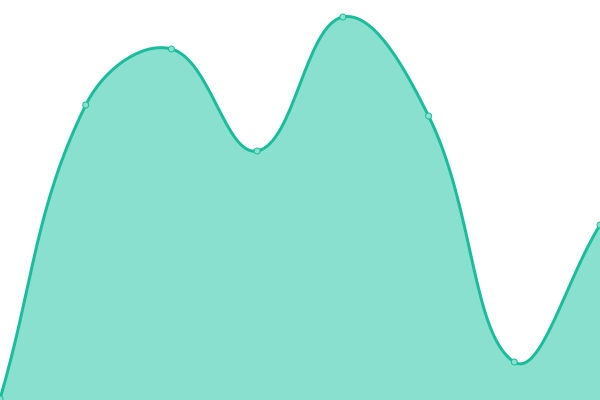
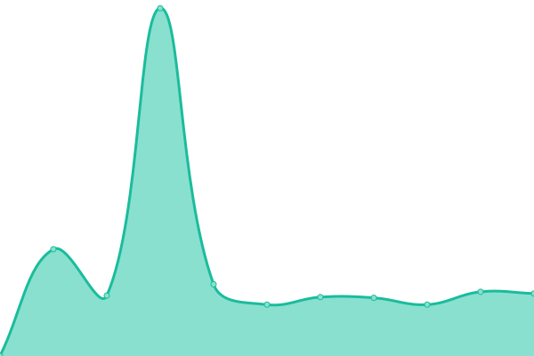

# [📈 Live Status](https://sfvc.github.io/upptime): <!--live status--> **🟧 Partial outage**

This repository contains the open-source uptime monitor and status page for [sfvc](https://sfvc.github.io/upptime), powered by [Upptime](https://github.com/upptime/upptime).

With [Upptime](https://upptime.js.org), you can get your own unlimited and free uptime monitor and status page, powered entirely by a GitHub repository. We use [Issues](https://github.com/sfvc/upptime/issues) as incident reports, [Actions](https://github.com/sfvc/upptime/actions) as uptime monitors, and [Pages](https://sfvc.github.io/upptime) for the status page.

<!--start: status pages-->
<!-- This summary is generated by Upptime (https://github.com/upptime/upptime) -->
<!-- Do not edit this manually, your changes will be overwritten -->
<!-- prettier-ignore -->
| URL | Status | History | Response Time | Uptime |
| --- | ------ | ------- | ------------- | ------ |
|  [CatamarcaCapital](https://www.catamarcaciudad.gob.ar) | 🟩 Up | [catamarca-capital.yml](https://github.com/sfvc/upptime/commits/HEAD/history/catamarca-capital.yml) | 

 3988ms
     
 | 

<a href="https://sfvc.github.io/upptime/history/catamarca-capital">99.65%</a>
    

|  [Civitas Juzgado](http://civitas.catamarcaciudad.gob.ar:8080/JUZ_CATA/forms/login.jsp) | 🟩 Up | [civitas-juzgado.yml](https://github.com/sfvc/upptime/commits/HEAD/history/civitas-juzgado.yml) | 

 764ms
     
 | 

<a href="https://sfvc.github.io/upptime/history/civitas-juzgado">85.81%</a>
    

|  [Civitas RRHH](http://civitas.catamarcaciudad.gob.ar:8080/GRH_CATA/forms/login.jsp) | 🟩 Up | [civitas-rrhh.yml](https://github.com/sfvc/upptime/commits/HEAD/history/civitas-rrhh.yml) | 

 205ms
     
 | 

<a href="https://sfvc.github.io/upptime/history/civitas-rrhh">99.74%</a>
    

|  [Turnero](https://turnos.catamarcacapital.gob.ar/) | 🟩 Up | [turnero.yml](https://github.com/sfvc/upptime/commits/HEAD/history/turnero.yml) | 

 450ms
     
 | 

<a href="https://sfvc.github.io/upptime/history/turnero">100.00%</a>
    

|  [Turnero CEL](https://turnos.catamarcacapital.gob.ar/cel/) | 🟩 Up | [turnero-cel.yml](https://github.com/sfvc/upptime/commits/HEAD/history/turnero-cel.yml) | 

 79ms
     
 | 

<a href="https://sfvc.github.io/upptime/history/turnero-cel">100.00%</a>
    

|  [Tu bienestar](https://tubienestar.catamarcacapital.gob.ar/solicitudes) | 🟩 Up | [tu-bienestar.yml](https://github.com/sfvc/upptime/commits/HEAD/history/tu-bienestar.yml) | 

 490ms
     
 | 

<a href="https://sfvc.github.io/upptime/history/tu-bienestar">0.00%</a>
    

|  [Planos](https://correcciondeplanos.catamarcaciudad.gob.ar/) | 🟩 Up | [planos.yml](https://github.com/sfvc/upptime/commits/HEAD/history/planos.yml) | 

 209ms
     
 | 

<a href="https://sfvc.github.io/upptime/history/planos">0.00%</a>
    

|  [Compras](https://compras.catamarcaciudad.gob.ar/) | 🟥 Down | [compras.yml](https://github.com/sfvc/upptime/commits/HEAD/history/compras.yml) | 

 0ms
     
 | 

<a href="https://sfvc.github.io/upptime/history/compras">0.00%</a>
    

|  [Empleo](https://beneficiarios.catamarcaciudad.gob.ar/) | 🟩 Up | [empleo.yml](https://github.com/sfvc/upptime/commits/HEAD/history/empleo.yml) | 

 300ms
     
 | 

<a href="https://sfvc.github.io/upptime/history/empleo">0.00%</a>
    

|  [Recibos](https://recibos.catamarcaciudad.gob.ar/acceso.php) | 🟩 Up | [recibos.yml](https://github.com/sfvc/upptime/commits/HEAD/history/recibos.yml) | 

 155ms
     
 | 

<a href="https://sfvc.github.io/upptime/history/recibos">0.00%</a>
    

|  [Trámites online Juzgado](http://juzgado.catamarcacapital.gob.ar/) | 🟩 Up | [tramites-online-juzgado.yml](https://github.com/sfvc/upptime/commits/HEAD/history/tramites-online-juzgado.yml) | 

 182ms
     
 | 

<a href="https://sfvc.github.io/upptime/history/tramites-online-juzgado">100.00%</a>
    

|  [Nodo](https://nodotecnologico.catamarcacapital.edu.ar/) | 🟩 Up | [nodo.yml](https://github.com/sfvc/upptime/commits/HEAD/history/nodo.yml) | 

 750ms
     
 | 

<a href="https://sfvc.github.io/upptime/history/nodo">99.95%</a>
    

|  [GIRO](https://giro.catamarcacapital.gob.ar/) | 🟩 Up | [giro.yml](https://github.com/sfvc/upptime/commits/HEAD/history/giro.yml) | 

 347ms
     
 | 

<a href="https://sfvc.github.io/upptime/history/giro">100.00%</a>
    

|  [Tu Decision](https://tudecision.catamarcacapital.gob.ar) | 🟩 Up | [tu-decision.yml](https://github.com/sfvc/upptime/commits/HEAD/history/tu-decision.yml) | 

 352ms
     
 | 

<a href="https://sfvc.github.io/upptime/history/tu-decision">100.00%</a>
    

|  [Catastro](https://catastro.catamarcaciudad.gob.ar/sfvccatastro/myLogin.php) | 🟩 Up | [catastro.yml](https://github.com/sfvc/upptime/commits/HEAD/history/catastro.yml) | 

 663ms
     
 | 

<a href="https://sfvc.github.io/upptime/history/catastro">100.00%</a>
    

|  [Transporte](https://transporte.catamarcacapital.gob.ar/login) | 🟩 Up | [transporte.yml](https://github.com/sfvc/upptime/commits/HEAD/history/transporte.yml) | 

 165ms
     
 | 

<a href="https://sfvc.github.io/upptime/history/transporte">0.00%</a>
    

|  [Economía Social](economiasocial.catamarcacapital.gob.ar) | 🟩 Up | [economia-social.yml](https://github.com/sfvc/upptime/commits/HEAD/history/economia-social.yml) | 

 620ms
     
 | 

<a href="https://sfvc.github.io/upptime/history/economia-social">100.00%</a>
    

|  [PEI](planestrategico.catamarcacapital.gob.ar) | 🟩 Up | [pei.yml](https://github.com/sfvc/upptime/commits/HEAD/history/pei.yml) | 

 405ms
     
 | 

<a href="https://sfvc.github.io/upptime/history/pei">100.00%</a>
    

|  [Inspecciones](inspecciones.catamarcaciudad.gob.ar) | 🟩 Up | [inspecciones.yml](https://github.com/sfvc/upptime/commits/HEAD/history/inspecciones.yml) | 

 913ms
     
 | 

<a href="https://sfvc.github.io/upptime/history/inspecciones">100.00%</a>
    

|  [Educación](educacion.catamarcaciudad.gob.ar) | 🟩 Up | [educacion.yml](https://github.com/sfvc/upptime/commits/HEAD/history/educacion.yml) | 

 836ms
     
 | 

<a href="https://sfvc.github.io/upptime/history/educacion">100.00%</a>
    

|  [Rentas](rentas.catamarcaciudad.gob.ar) | 🟩 Up | [rentas.yml](https://github.com/sfvc/upptime/commits/HEAD/history/rentas.yml) | 

 1791ms
     
 | 

<a href="https://sfvc.github.io/upptime/history/rentas">84.91%</a>
    

<!--end: status pages-->

[**Visit our status website →**](https://sfvc.github.io/upptime)

## 📄 License

- Powered by: [Upptime](https://github.com/upptime/upptime)
- Code: [MIT](./LICENSE) © [sfvc](https://sfvc.github.io/upptime)
- Data in the `./history` directory: [Open Database License](https://opendatacommons.org/licenses/odbl/1-0/)
